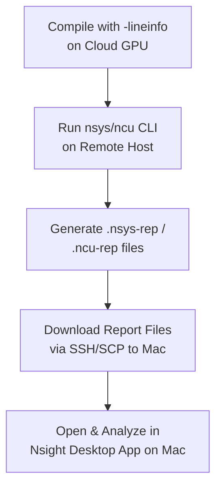

To build high-performance CUDA applications, writing correct kernels is only the first step. The real challenge lies in identifying bottlenecks and optimizing resource utilization. NVIDIA provides a powerful suite of profiling tools designed to analyze every layer of execution.

This section introduces the core tools: **Nsight Systems (`nsys`)**, **Nsight Compute (`ncu`)**, and the **NVIDIA Tools Extension (NVTX)**, and details the workflow for profiling on remote GPU instances (such as Cloud GPUs or Lightning Studios) and analyzing the results locally on macOS.

---

## The Remote Profiling Workflow

Since macOS does not support modern NVIDIA GPUs, the standard industry workflow separates **profiling data collection** from **performance visualization**:

<div align="center">



</div>

1. **Compile with Debug Symbols**: Ensure you include `-lineinfo` when compiling. This maps profiling metrics directly to the corresponding lines in your source code.
2. **Collect Reports on Remote Host**: Run your binary through `nsys` or `ncu` command line on the cloud instance to produce report files.
3. **Transfer to Mac**: Download the `.nsys-rep` or `.ncu-rep` files to your local machine.
4. **Visualize**: Open the reports in the **NVIDIA Nsight Systems** or **NVIDIA Nsight Compute** desktop apps installed on your Mac.

---

## Nsight Systems vs. Nsight Compute

Understanding when to use which tool is crucial for efficient performance tuning:

| Metric / Feature | Nsight Systems (`nsys`) | Nsight Compute (`ncu`) |
| :--- | :--- | :--- |
| **Primary Scope** | System-Wide Timeline | Single Kernel Detailed Analysis |
| **View Type** | Timeline (Gantt chart of events) | Metric Dashboard & Rule-based Warnings |
| **Key Insights** | CPU-GPU overhead, memory copy/kernel overlap, API latency | Memory throughput, compute utilization, occupancy, bank conflicts |
| **Overhead** | Very low (suitable for entire runs) | High (due to hardware counter serialization) |
| **Output File** | `.nsys-rep` | `.ncu-rep` |

### Recommended Profiling Strategy
1. **Identify the Bottleneck** using **Nsight Systems**. Spot issues like serialization (kernels waiting on memory copies) or CPU-GPU execution gaps.
2. **Zoom In** using **Nsight Compute** on the specific, slow kernels discovered in the timeline to analyze their memory and compute efficiency.

---

## NVIDIA Tools Extension (NVTX)

**NVTX** is a C-based API for annotating tasks, memory copies, and execution phases in your application. When visualized in Nsight Systems, these annotations appear as labeled, color-coded ranges on the timeline.

Without NVTX, a long timeline of multiple kernel launches and memory transfers can be extremely difficult to navigate. NVTX groups these operations into logical application phases.

### Basic Code Integration

Include the header `<nvtx3/nvtx3.hpp>` and wrap execution blocks in ranges:

```cpp
#include <nvtx3/nvtx3.hpp>

void processData() {
    // Automatically starts range here and ends it when the object goes out of scope
    nvtx3::scoped_range range("Data Processing Phase");

    // Alternatively, manually push and pop ranges:
    nvtxRangePushA("Copying Inputs to Device");
    cudaMemcpy(d_input, h_input, size, cudaMemcpyHostToDevice);
    nvtxRangePop();

    nvtxRangePushA("Compute Kernel Execution");
    myKernel<<<grid, block>>>(d_input, d_output);
    cudaDeviceSynchronize();
    nvtxRangePop();
}
```

---

## Quick Reference CLI Commands

Given a CUDA program source file `my_cuda_exe.cu`, compile it with optimizations (`-O3`) and line info tracking (`-lineinfo`):

```bash
nvcc -O3 -lineinfo my_cuda_exe.cu -o my_cuda_exe
```

Now, use the compiled executable `my_cuda_exe` to run the following profiling commands:

### 1. Nsight Systems (`nsys`)

To capture a system-wide timeline showing CUDA API calls, NVTX ranges, and OS runtime activities:

```bash
nsys profile \
  --trace=cuda,nvtx,osrt \
  --output=profile_run_v1 \
  --force-overwrite=true \
  ./my_cuda_exe
```

### 2. Nsight Compute (`ncu`)

To profile a specific kernel's instruction and hardware-level performance:

```bash
ncu \
  --kernel-name myKernel \
  --launch-count 1 \
  --set full \
  --output kernel_analysis_v1 \
  ./my_cuda_exe
```

> [!TIP]
> Always profile release builds (`-O3`) rather than debug builds (`-g` without optimization), but keep `-lineinfo` enabled to ensure compilation optimizations are active while retaining source file correlation.


---

## Download GUI for macOS

- https://developer.nvidia.com/nsight-systems/get-started
- https://developer.nvidia.com/tools-overview/nsight-compute/get-started

---

## Download CLI tools for Ubuntu (remote machine)

- [nvidia cuda toolkit](https://developer.nvidia.com/cuda-downloads?target_os=Linux&target_arch=x86_64&Distribution=Ubuntu&target_version=24.04&target_type=deb_local)

## Removing Cuda toolkit

```bash
sudo apt-get --purge remove "*cublas*" "cuda*" "nsight*"
sudo apt-get autoremove --purge
sudo rm -rf /usr/local/cuda-X.X
```
