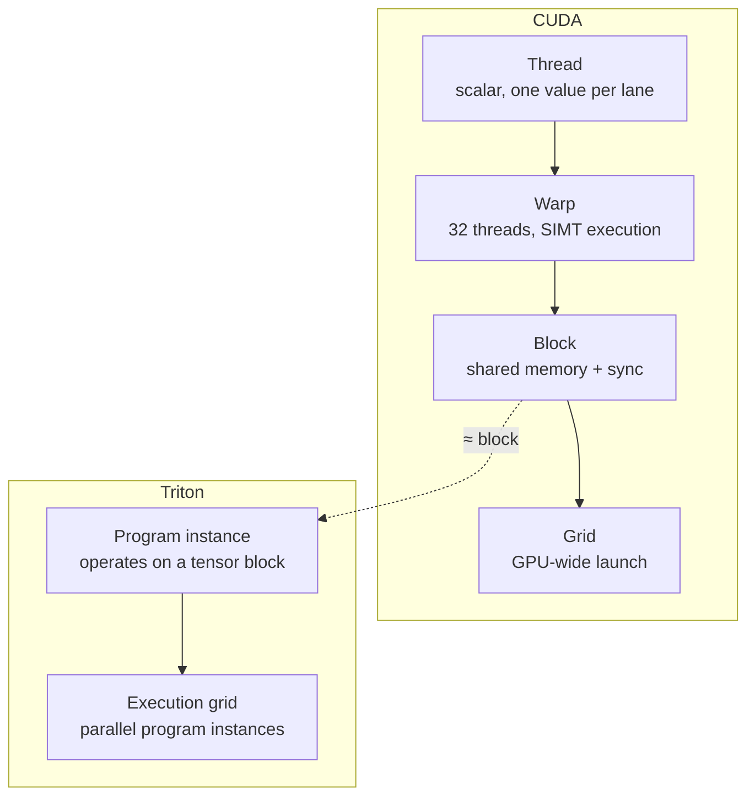

**Triton**: `language and compiler ecosystem` developed by `OpenAI`.
> `Designed to write highly efficient custom Deep Learning primitives`. It `bridges the gap` between high-level ease-of-use (Python) and low-level performance, `matching or exceeding expert-written C++ CUDA kernels`.

The ecosystem operates on two distinct programming tiers depending on how much control you need over the hardware:
1. **`Standard Triton (Block-Level)`:** Abstracts away thread indexing, shared memory allocation, and warp synchronization. You write sequential code operating on structured blocks (tensors).
2. **`Gluon (Explicit Low-Level)`:** Triton’s explicit, lower-level GPU programming model. It trades standard Triton's convenience for absolute hardware control, exposing layouts, shared memory, warp specialization, and target-specific features directly.

---


## The Triton Programming Model

Triton abstracts away the low-level thread-block execution model of CUDA. Instead of writing kernel code from the perspective of an individual thread (like CUDA's single-instruction multiple-threads or SIMT), you write sequential code from the perspective of a **Program Instance** (**`analogous to a CUDA thread block`**) operating on **Tensors of Blocks**.

### Key Differences from CUDA



* **No Thread-Level Indexing:** You do not manage individual thread IDs (`threadIdx.x`), warp lane IDs, or manual shared memory offsets.
* **Block-Level Operations:** The fundamental unit of execution is a block tensor (e.g., a $128 \times 64$ float matrix). Operations on these blocks (like element-wise addition or matrix multiplication) are written as single-line array operations.
* **Tensors of Pointers:** Instead of loading a scalar per thread, you construct an array of pointers (a pointer offset from a base address) and load/store the entire block in a single API call.

---

## The Block Sizing Rule: Powers of Two

> [!IMPORTANT]
> In standard Triton, all block dimensions (e.g., `BLOCK_SIZE_M`, `BLOCK_SIZE_N`) **must be compile-time constants (`tl.constexpr`) and must be powers of two** (e.g., 16, 32, 64, 128, 256...).

### Why this is a Hardware Requirement:
1. **Instruction Alignment:** GPUs fetch and process memory in chunks of 32 elements (warps). Power-of-two block dimensions guarantee that memory transactions align perfectly with hardware load/store units.
2. **Tensor Core Layouts:** Tensor Cores (MMA - Matrix Multiply-Accumulate instructions) require inputs in specific dimensions (e.g., $16 \times 16 \times 16$). Power-of-two shapes map cleanly to these matrix math engines.

### Masking & Boundary Conditions
Since block sizes are forced to be powers of two, your inputs will rarely fit perfectly. If your input size is $N = 100$, and your block size is $128$, you must use **boundary masks** to guard against out-of-bounds memory accesses.

---

## Core Triton (`triton`) Module APIs

The top-level `triton` module provides the structural decorators and configuration objects necessary to compile, automatically tune, and optimize custom hardware-backed execution routines. 

It also provides some utilities for working with Triton kernels. (like `triton.cdiv`, `triton.next_power_of_2`, `triton.reinterpret`, etc.)

---

## Core Triton Language (`tl`) APIs

The `triton.language` module (typically imported as `tl`) provides the building blocks for memory, math, and shaping.

> Triton kernels are only allowed to use `tl.*` APIs (i.e. `triton.language.*`). Using other triton apis can give compiler error, bcoz of no appropriate lowering to MLIR dialect.
> There are some exceptions: like, `triton.ceil_div`, etc. But, still recommend to stick to `triton.language.ceil`.

---

## CUDA vs. Triton Side-by-Side: Vector Addition

To see how the programming paradigms shift, here is a simple Vector Add kernel ($Z = X + Y$) written in both languages:

### 1. The CUDA C++ Approach (Thread-Centric)

```cpp
__global__ void vector_add_cuda(const float* x, const float* y, float* z, int N) {
    // 1. Thread gets its unique index in the global grid
    int idx = blockIdx.x * blockDim.x + threadIdx.x;
    
    // 2. Perform scalar load, add, and store if within bounds
    if (idx < N) {
        z[idx] = x[idx] + y[idx];
    }
}

int main(){
  // ...
  // launching kernel
  vector_add_cuda<<<blocksPerGrid, threadsPerBlock>>>(arguments);
}
```

### 2. The Triton Python Approach (Block-Centric)

```python
import triton
import triton.language as tl

@triton.jit
def vector_add_triton(
    x_ptr, y_ptr, z_ptr, N, 
    BLOCK_SIZE: tl.constexpr # Block size is marked as compile-time constant
):
    # 1. Identify which program instance we are in (analogous to blockIdx)
    pid = tl.program_id(axis=0)
    
    # 2. Compute the memory offsets for this block
    block_start = pid * BLOCK_SIZE
    offsets = block_start + tl.arange(0, BLOCK_SIZE)
    
    # 3. Create a boundary mask to prevent reading out-of-bounds
    mask = offsets < N
    
    # 4. Load the entire block vector from global memory using the mask
    x = tl.load(x_ptr + offsets, mask=mask)
    y = tl.load(y_ptr + offsets, mask=mask)
    
    # 5. Perform the vector operation (compiled to vector assembly instructions)
    z = x + y
    
    # 6. Store the resulting block back to global memory
    tl.store(z_ptr + offsets, z, mask=mask)
  
# launching kernel
def main():
  ...
  BLOCK_SIZE = 1024
  grid = (triton.cdiv(N, BLOCK_SIZE),)
  vector_add_kernel[grid](a, b, c, N, BLOCK_SIZE)
```

---

## Behind the Scenes: Triton Compiler Optimizations

When you run `@triton.jit`, the compiler automates the hardest parts of GPU optimization:

### 1. Automatic Memory Coalescing
In CUDA, you must carefully design thread indexes to access contiguous global memory to achieve coalesced reads (32 contiguous threads reading 32 contiguous floats). In Triton, as long as you construct pointer offsets using contiguous ranges (e.g., `base_ptr + tl.arange(0, BLOCK_SIZE)`), the compiler **automatically coalesces the memory accesses** into wide 128-bit load/store instructions.

### 2. Automatic Shared Memory Management
In CUDA, to reuse data (e.g., in matrix multiplication), you must allocate shared memory (`__shared__`), load data into it, synchronize threads (`__syncthreads()`), perform computations, and synchronize again. 
Triton manages this completely under the hood:
* The compiler analyzes the lifetime of intermediate block tensors.
* It automatically allocates the required SRAM (Shared Memory) inside the SM.
* It inserts necessary memory fences and warp synchronizations at the MLIR level, eliminating race conditions.

### 3. Software Pipelining
For operations like matrix multiply (`tl.dot`), Triton automatically sets up **double buffering** or **multi-buffering**. While the Tensor Cores are computing on the current tile in shared memory, the memory controllers are pre-fetching the next tile from global memory (VRAM) directly into shared memory. This hides global memory latency almost entirely.

---

## Interview Questions & Answers

### Q: Why does Triton require block sizes to be compile-time constants (`tl.constexpr`)?

**Answer:** If block sizes were dynamic runtime variables, the compiler could not determine register allocation, shared memory requirements, or hardware mapping at compilation time. By enforcing compile-time constants (via `tl.constexpr`), the Triton compiler can unroll loops, decide how to tile memory across L1/L2 caches, configure the exact amount of shared memory per SM, and generate specialized machine assembly code targeting the GPU's registers directly.

### Q: How does Triton handle bank conflicts in shared memory?

**Answer:** In CUDA, if multiple threads in a warp access the same memory bank in shared memory, it causes a bank conflict, serializing the accesses. Triton avoids this by analyzing layout descriptors of tensors in its MLIR optimization passes. It automatically applies layout transformations (like swizzling) to memory allocations in SRAM, ensuring memory accesses from different warps and lanes are routed to different banks without requiring manual padding from the developer.

### Q: What is the risk of selecting a block size (`BLOCK_SIZE`) that is too large or too small?

**Answer:** 
* **Too Large:** A block size that is too large (e.g., 1024 or 2048) requires a massive number of registers and shared memory. This can lead to **register spilling** (variables overflowing to slow local memory) or reduce occupancy (fewer blocks running concurrently on the SM because of shared memory limits).
* **Too Small:** A block size that is too small (e.g., 8 or 16) fails to saturate the GPU's memory bandwidth or compute pipelines. It prevents memory coalescing (which requires contiguous accesses of at least 32 or 64 bytes) and underutilizes Tensor Cores, which require larger tiling dimensions to run efficiently.


---

## The Dual-Layer Architecture: Standard Triton vs. Gluon

When writing high-performance kernels, your requirements dictate which API layer you tap into:

### 1. Standard Triton: High-Level Block Abstraction
* **How it works:** You work with high-level tensor blocks (e.g., $128 \times 64$). The compiler completely automates memory management.
* **Memory Hierarchy:** The compiler analyzes tensor lifespans and automatically manages the allocation, sizing, and optimization of data within **SRAM (Shared Memory/L1 Cache)**.
* **Synchronization:** No manual barriers. The compiler automatically schedules optimal memory co-alescing and inserts necessary warp synchronization.

### 2. Gluon: The Low-Level Control Layer
As an ML Performance Engineer, standard block abstractions sometimes leave performance on the table. **Gluon** is introduced to give you back explicit hardware knobs:
* **Explicit Layouts:** Allows you to control exactly how tensors are mapped across threads and registers, which is crucial for maximizing Tensor Core utilization (MMA layouts) and preventing bank conflicts.
* **Manual Shared Memory:** Gives you direct access to shared memory management, allowing you to orchestrate custom software pipelining and data reuse patterns.
* **Warp Specialization:** Enables you to dedicate different warps within the same threadblock to different tasks (e.g., some warps focus entirely on loading data from HBM to SRAM, while others focus entirely on computing on Tensor Cores), drastically reducing execution stalls.

---

## Why This Architecture Matters (Programmability vs. Control)

Traditionally, optimizing deep learning models presented a fragmented workflow:

* **PyTorch (Eager/High-Level):** High productivity, but poor memory locality. Successive operations force intermediate data back to High-Bandwidth Memory (HBM), creating bandwidth bottlenecks.
* **Native C++ CUDA:** Maximum performance via manual kernel fusion, but brutal development velocity. Requires managing complex thread indexing, race conditions, and poor portability.

**Triton + Gluon provides a unified continuum.** You can write 90% of your kernel logic using standard Triton blocks. For the final, ultra-critical 10% performance bottleneck (like an highly optimized FlashAttention variant or a complex GEMM), you can drop down into **Gluon** to explicitly tune layouts and warp execution without leaving the Triton ecosystem.

---

## How It Works Under the Hood (Compilation Flow)

Whether written in standard Triton or low-level Gluon, the execution undergoes a multi-stage compilation process:

1. **Python AST Parsing:** Parses the frontend function into an Abstract Syntax Tree.
2. **Triton MLIR Dialects:** The code is lowered into Triton’s specific MLIR (Multi-Level Intermediate Representation) dialects, capturing block-level ops.
3. **Optimization Passes:** The compiler optimizes the IR (dead code elimination, liveness analysis to minimize SRAM footprint, and memory pipelining). If Gluon is used, your explicit layout and warp choices constrain and guide these passes directly.
4. **LLVM IR Translation:** The optimized Triton IR is translated into LLVM IR.
5. **Target Code Generation:** LLVM compiles the code into device-specific assembly (e.g., `.ptx` for NVIDIA or AMDGPU code), which is JIT-compiled into an executable binary (`.cubin`) by the driver.

---

## Interview Cheat Sheet: Standard Triton vs. Gluon vs. CUDA

| Optimization Vector | CUDA Approach | Standard Triton | Gluon Layer |
| :--- | :--- | :--- | :--- |
| **Abstractions** | Threads, Warps, Blocks, Grids. | **Program Instances** handling tensor blocks. | **Program Instances** with explicit hardware layouts. |
| **Shared Memory** | Explicitly allocated and indexed (`__shared__`). | Automated entirely by the compiler. | **Explicitly exposed** for developer management. |
| **Warp Management** | Manual scheduling and warp primitives (`__shfl_sync`). | Hidden/Abstracted. | **Warp Specialization** explicitly supported. |
| **Tensor Cores** | Manual invocation of `wmma` / `mma.sync` PTX. | Automated via high-level `tl.dot` primitives. | Fine-grained layout control to maximize MMA layout efficiency. |

---

### 💡 Interview Alignment

> [!warning]
> If asked about performance tuning in Triton, you can now confidently say:
>
> *"While standard Triton automates memory and warp scheduling perfectly for most tasks, if I hit a bottleneck with memory stalls or poor tensor core layouts, I can drop into Triton’s **Gluon layer** to explicitly manage layouts and warp specialization."*

```python
import torch
import triton
import triton.language as tl

@triton.jit
def sum_kernel(a: torch.Tensor, b: torch.Tensor, c: torch.Tensor, N: int, BLOCK_SIZE: tl.constexpr):
    pid = tl.program_id(0)
    block_start = pid * BLOCK_SIZE
    offset = block_start + tl.arange(0, BLOCK_SIZE)

    mask = offset < N

    a_val = tl.load(a + offset, mask=mask)
    b_val = tl.load(b + offset, mask=mask)
    c_val = a_val + b_val

    tl.store(c + offset, c_val, mask=mask)


def main():
    N = 4096
    a = torch.randn(N, device="cuda")
    b = torch.randn(N, device="cuda")
    c = torch.empty(N, device="cuda")

    BLOCK_SIZE = tl.constexpr(256)
    # grid = (triton.cdiv(N, BLOCK_SIZE.value),)
    grid = lambda meta: (triton.cdiv(N, meta['BLOCK_SIZE']),)

    sum_kernel[grid](a, b, c, N, BLOCK_SIZE=BLOCK_SIZE)

    triton.testing.assert_close(c, a + b)


if __name__ == "__main__":
    main()
```
