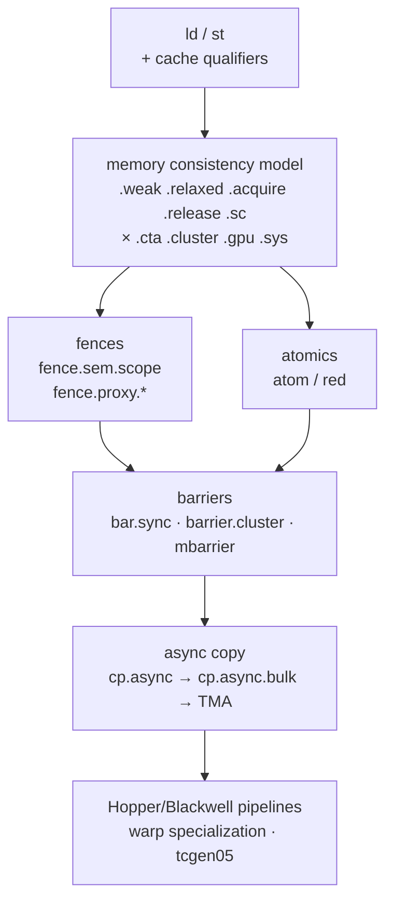
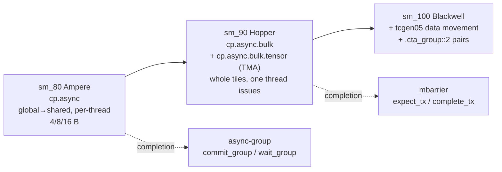

This is the note that makes Hopper and Blackwell kernels readable. Everything modern — TMA, warp specialization, clusters, `tcgen05` — is built out of the primitives here.



---

## 1. Addressing

Two address flavours, as introduced in note 01:

| | Windowed | Generic |
|---|---|---|
| Instruction | `ld.global.f32`, `st.shared.f32` | `ld.f32`, `st.f32` |
| Address is | an offset in that space's window | a flat address covering all windows |
| Cost | cheaper (space known statically) | needs runtime window resolution |

```ptx
cvta.to.global.u64   %rd2, %rd1;    // generic → global   (the nvcc prologue idiom)
cvta.global.u64      %rd3, %rd2;    // global  → generic
cvta.shared::cta.u32 %r2,  smem;    // shared symbol → address
mapa.shared::cluster.u32 %r3, %r2, %r_rank;   // same smem var, but in ANOTHER CTA of the cluster
isspacep.shared      %p1, %rd1;     // runtime "which window is this in?"
getctarank.u32       %r4, %rd1;     // which CTA of the cluster owns this address
```

> [!IMPORTANT]
> **Shared-memory addresses are 32-bit.** `st.shared.f32 [%r9], %f1;` uses a `.b32` register because the shared window is small. Global addresses are 64-bit `%rd`. Mixing them up is the single most common inline-PTX bug — see note 05.

---

## 2. `ld` / `st` qualifiers in full

```text
ld{.weak|.volatile|.relaxed.scope|.acquire.scope}{.ss}{.cop}
  {.level1::eviction_priority}{.level2::eviction_priority}
  {.L2::cache_hint}{.L2::prefetch_size}{.vec}.type   d, [a]{, cache_policy};
```

| Group | Values | Meaning |
|---|---|---|
| **State space** `.ss` | `.const .global .local .param{::entry,::func} .shared{::cta,::cluster}` | omit → generic |
| **Cache op** `.cop` (loads) | `.ca` (default, L1+L2) · `.cg` (L2 only, bypass L1) · `.cs` (streaming, evict-first) · `.lu` (last use) · `.cv` (don't cache, re-fetch) | **performance hints only** — they never change consistency semantics |
| **Cache op** (stores) | `.wb` (default) · `.cg` (L2 only) · `.cs` (streaming) · `.wt` (write-through) | |
| **Eviction priority** | `.L1::evict_normal/_first/_last/_unchanged/no_allocate`, `.L2::evict_normal/_first/_last` | keep hot tiles resident, stream cold ones |
| **Prefetch** | `.L2::64B` · `.L2::128B` · `.L2::256B` | fetch more than you asked for |
| **Vector** `.vec` | `.v2` · `.v4` · `.v8` (`.v8` needs 32-bit types + global, sm_100+) | width; alignment is your problem |
| **Type** | `.b8…​.b128 .u8…​.u64 .s8…​.s64 .f32 .f64` | always last |
| **Non-coherent** | `ld.global.nc.*` (a separate instruction form) | read-only data cache; requires the data isn't written this kernel |

```ptx
ld.global.nc.L1::evict_last.v4.f32  {%f1,%f2,%f3,%f4}, [%rd7];
st.global.cs.v4.f32                 [%rd8], {%f5,%f6,%f7,%f8};
createpolicy.fractional.L2::evict_last.b64 %policy, 0.25;
ld.global.L2::cache_hint.f32        %f9, [%rd9], %policy;
```

> [!TIP]
> Cache qualifiers are a **hint layer**: they can change performance drastically and can never change correctness. If you need ordering or visibility guarantees, that's `.relaxed`/`.acquire`/`.release` + scopes — a different, orthogonal set of qualifiers.

---

## 3. The memory consistency model

PTX has a real, formally specified weak memory model. Three orthogonal axes:

### Axis 1 — the operation's strength

| Qualifier | Meaning |
|---|---|
| `.weak` (default) | no synchronization at all; only ordered by data dependence |
| `.volatile` | not optimized away/reordered by the compiler; **not** a synchronization primitive |
| `.relaxed` | atomic w.r.t. the given scope, but no ordering with other addresses |
| `.acquire` | this load, plus all later ops in program order, are ordered after it |
| `.release` | this store, plus all earlier ops in program order, are ordered before it |
| `.acq_rel` | both (on atomics/fences) |
| `.sc` | sequentially consistent (on `fence` only) |
| `.mmio` | memory-mapped IO semantics; `.sys` scope only |

### Axis 2 — scope: *who* is synchronized with

| Scope | Set of threads |
|---|---|
| `.cta` | this thread block |
| `.cluster` | this CTA cluster (Hopper+) |
| `.gpu` | all threads on this device |
| `.sys` | all threads on all devices + the host |

Cost rises monotonically. `atom.global.add.u32` with default `.gpu` scope is much more expensive than `atom.global.cta.add.u32` when a block-local counter would do.

### Axis 3 — proxy: *through which path* memory is accessed

A **proxy** is a distinct hardware path to memory. Same address through two proxies needs an explicit cross-proxy fence.

| Proxy | Used by |
|---|---|
| *generic* | ordinary `ld` / `st` / `atom` |
| **async** | `cp.async.bulk`, `cp.reduce.async.bulk`, TMA, `wgmma`'s shared-memory reads |
| **tensormap** | `tensormap.replace` writes to a TMA descriptor |
| *alias* | different addresses that alias the same location |

```ptx
fence.proxy.async;                 // generic ↔ async, both directions
fence.proxy.async.shared::cta;     // narrowed to shared memory
fence.proxy.tensormap::generic.release.gpu;              // after editing a tensormap
fence.proxy.tensormap::generic.acquire.gpu [%tmap], 128; // before a TMA that uses it
```

> [!IMPORTANT]
> This is the rule people trip over first on Hopper: **if a thread writes shared memory with ordinary `st.shared` and then a `wgmma` or TMA-store reads it, you need `fence.proxy.async.shared::cta` in between.** The regular `bar.sync` is not enough — it orders the *generic* proxy only.

### Fences

```ptx
fence.sc.gpu;              // sequentially consistent fence, device scope
fence.acq_rel.cta;         // acquire+release within the block
fence.mbarrier_init.release.cluster;   // publish an mbarrier init to the cluster
membar.gl;   membar.cta;   membar.sys; // legacy spelling; membar.gl ≈ fence.sc.gpu
```

---

## 4. Atomics: `atom` vs `red`

```ptx
atom{.sem}{.scope}{.space}.op{.L2::cache_hint}.type  d, [a], b{, policy};
atom{.sem}{.scope}{.space}.cas.type                  d, [a], b, c;
red{.sem}{.scope}{.space}.op.type                       [a], b;      // no destination
```

| | Returns old value | Use |
|---|---|---|
| `atom` | yes | you need the previous value (ticket counters, CAS loops) |
| `red` | **no** | fire-and-forget reductions — cheaper, no return trip |

Ops: `.and .or .xor .add .inc .dec .min .max .exch .cas`.
Types: `.b32 .b64 .b128 .u32 .u64 .s32 .s64 .f32 .f64`, plus `.f16 .f16x2 .bf16 .bf16x2` for `add` (with `.noftz`), and vector forms `.v2/.v4/.v8` on sm_90+.

```ptx
red.global.add.f32           [%rd1], %f1;          // atomicAdd, result unused
atom.global.cta.add.u32      %r1, [%rd2], 1;       // block-scoped counter — cheap
atom.global.acq_rel.gpu.cas.b32 %r2, [%rd3], %r_expected, %r_new;
atom.add.noftz.f16x2         %r3, [%rd4], %r4;     // two half adds atomically
atom.global.b128.exch        %rd5, [%rd6], %rd7;   // 128-bit atomic (sm_90+)
```

> [!TIP]
> Two easy wins visible in PTX: (1) if you see `atom` where the result is dead, get the compiler to emit `red` by not using the return value; (2) if you see default (`.gpu`) scope on a counter that only the block touches, add `cuda::atomic_ref<..., thread_scope_block>` or `atomicAdd_block` to get `.cta`.

---

## 5. Barriers

### CTA barriers

```ptx
bar.sync      0;             // __syncthreads()      — arrive AND wait
bar.cta.sync  1, 128;        // named barrier 1, 128 threads participating
bar.arrive    0, 256;        // arrive, do NOT wait (split barrier)
bar.red.popc.u32  %r1, 0, %p1;   // __syncthreads_count()
bar.red.and.pred  %p2, 0, %p1;   // __syncthreads_and()
bar.warp.sync -1;            // __syncwarp(0xffffffff)
```

There are **16 named barriers** per CTA (`0`–`15`). `bar.arrive` + a later `bar.sync` on a *different* barrier is the classic producer/consumer split — and the conceptual ancestor of `mbarrier`.

### Cluster barriers (Hopper+)

```ptx
barrier.cluster.arrive.release.aligned;
...
barrier.cluster.wait.acquire.aligned;
```

`.aligned` asserts all threads in the CTA execute it — like `__syncthreads()`'s convergence requirement.

---

## 6. Clusters and distributed shared memory

A **cluster** is a group of CTAs (up to 8 on H100) co-scheduled on the same GPC, whose shared memory windows are mutually addressable.

```ptx
mov.u32 %r1, %cluster_ctarank;    // my CTA's rank in the cluster
mov.u32 %r2, %cluster_nctarank;   // cluster size

// address of `tile` as it exists in CTA number %r_peer
mov.u32 %r3, tile;
mapa.shared::cluster.u32 %r4, %r3, %r_peer;
ld.shared::cluster.f32   %f1, [%r4];      // read a peer CTA's shared memory (DSMEM)
st.shared::cluster.f32   [%r4], %f2;      // or write it
```

Declared from CUDA with `__cluster_dims__(x,y,z)`, which becomes `.reqnctapercluster` / `.explicitcluster` / `.maxclusterrank` in PTX.

Why it matters: DSMEM lets a TMA load land **once** and be multicast to every CTA in the cluster (`.multicast::cluster`), which is how Hopper GEMMs cut global-memory traffic for the B operand.

---

## 7. Asynchronous copy, generation by generation



Two completion mechanisms exist across the whole family:

| Mechanism | Instructions | Shape |
|---|---|---|
| **Async-group** | `cp.async.commit_group` / `cp.async.wait_group N` | in-order batches; `N` = how many groups may remain outstanding |
| **mbarrier** | `mbarrier.arrive.expect_tx` / `mbarrier.try_wait` | out-of-order, byte-counted; required for TMA |

### 7.1 `cp.async` (Ampere)

Copies global → shared **without** passing through registers, so it doesn't consume register file or occupy the LSU round-trip.

```ptx
cp.async.ca.shared::cta.global [%r_smem], [%rd_gmem], 16;      // 16 B, cache in L1+L2
cp.async.cg.shared::cta.global [%r_smem], [%rd_gmem], 16;      // 16 B only, bypass L1
cp.async.cg.shared.global.L2::128B [%r_s], [%rd_g], 16;        // with prefetch hint
cp.async.ca.shared.global      [%r_s], [%rd_g], 16, %r_srcsize; // zero-fill the tail
@%p cp.async.ca.shared.global  [%r_s], [%rd_g], 4, %p_ignore;   // predicated

cp.async.commit_group;
cp.async.wait_group 2;     // wait until ≤2 groups remain in flight  ← software pipelining
cp.async.wait_all;
```

`cp-size` is 4, 8, or 16 bytes; `.cg` requires 16. The classic multi-stage pipeline issues stage *k+N*'s copies, then `wait_group N-1` before consuming stage *k*.

CUDA-level equivalent: `cuda::memcpy_async` / `__pipeline_memcpy_async`.

### 7.2 `mbarrier` — the transaction barrier

An `mbarrier` is a **64-bit object in shared memory** that tracks two counts at once:

- an **arrival count** (threads, like a classic barrier), and
- a **transaction count** (bytes, for async copies).

A phase completes when *both* reach zero. This is what lets a barrier wait on "512 threads arrived **and** 32 KB of TMA data landed."

```ptx
.shared .align 8 .b64 bar;

// ── lifecycle ────────────────────────────────────────────────────────
mbarrier.init.shared::cta.b64  [bar], 128;    // 128 expected arrivals
mbarrier.inval.shared::cta.b64 [bar];         // before reusing the memory for something else

// ── arrivals ─────────────────────────────────────────────────────────
mbarrier.arrive.shared::cta.b64            %rd_state, [bar];             // plain arrive
mbarrier.arrive.expect_tx.shared::cta.b64  %rd_state, [bar], 32768;      // arrive + "expect 32 KB"
mbarrier.expect_tx.shared::cta.b64         [bar], 32768;                 // expect only
mbarrier.arrive.release.cluster.shared::cluster.b64 _, [remote_bar];     // arrive on a peer CTA's barrier
mbarrier.arrive_drop...                                                   // arrive and leave the barrier

// ── waiting ──────────────────────────────────────────────────────────
$wait:
mbarrier.try_wait.parity.shared::cta.b64 %p1, [bar], %r_phase;   // non-blocking poll
@!%p1 bra $wait;
```

**Two ways to wait**, and the difference matters:

| | `mbarrier.test_wait` | `mbarrier.try_wait` |
|---|---|---|
| Semantics | pure test — returns immediately | may **sleep** the warp until completion or a timeout |
| Loop | needs `nanosleep` to avoid hammering | just spin on the predicate |

**Two ways to identify the phase:**
- with a **state token** (`%rd_state` returned by your own `mbarrier.arrive`), or
- with **parity** (`mbarrier.*.parity`), a 0/1 bit that flips each phase — the form used in loops, because you can just track `phase ^= 1` per iteration.

```ptx
// canonical loop-carried wait
and.b32     %r_par, %r_iter, 1;
$wait:
mbarrier.try_wait.parity.shared::cta.b64 %p1, [bar], %r_par;
@!%p1 bra   $wait;
```

Pairing `cp.async` with an mbarrier (instead of async-groups):

```ptx
mbarrier.init.shared.b64 [bar], N;
cp.async.ca.shared.global [%r_s], [%rd_g], 16;
cp.async.mbarrier.arrive.shared::cta.b64 [bar];   // "when my cp.asyncs land, arrive on bar"
```

### 7.3 Bulk copy and TMA (`cp.async.bulk{.tensor}`)

**TMA (Tensor Memory Accelerator)** is a dedicated copy engine. One thread issues a descriptor-driven copy of a whole multidimensional tile; the hardware handles addressing, boundary clamping, and swizzling.

```ptx
// ── plain bulk copy (1-D, byte count) ────────────────────────────────
cp.async.bulk.shared::cluster.global.mbarrier::complete_tx::bytes
        [%r_dst], [%rd_src], %r_bytes, [bar];

// ── tensor copy: global → shared, driven by a tensormap ──────────────
cp.async.bulk.tensor.2d.shared::cluster.global.tile.mbarrier::complete_tx::bytes
        [%r_smem], [%rd_tmap, {%r_x, %r_y}], [bar];

// with cluster multicast: one fetch, delivered to several CTAs
cp.async.bulk.tensor.2d.shared::cluster.global.mbarrier::complete_tx::bytes.multicast::cluster
        [%r_smem], [%rd_tmap, {%r_x, %r_y}], [bar], %rs_ctaMask;

// ── tensor copy: shared → global (store), async-group completion ─────
cp.async.bulk.tensor.2d.global.shared::cta.bulk_group
        [%rd_tmap, {%r_x, %r_y}], [%r_smem];
cp.async.bulk.commit_group;
cp.async.bulk.wait_group.read 0;     // .read = wait only until the source smem is re-usable

// ── prefetch into L2 ─────────────────────────────────────────────────
cp.async.bulk.prefetch.tensor.2d.L2.global [%rd_tmap, {%r_x, %r_y}];
```

Dimensions `.1d` … `.5d`. Load modes:

| Mode | Use |
|---|---|
| `.tile` | plain rectangular tile — the GEMM case |
| `.tile::gather4` / `.tile::scatter4` | four rows gathered/scattered by index |
| `.im2col`, `.im2col::w`, `.im2col::w::128` | convolution im2col transform done **in the copy engine** |

The **tensormap** (`CUtensorMap`, 128 bytes, 64-byte aligned) holds base address, per-dim sizes/strides, box shape, element type, swizzle mode, and out-of-bounds fill. Built host-side with `cuTensorMapEncodeTiled`, or patched device-side:

```ptx
tensormap.replace.tile.global_address.global.b1024.b64 [%rd_tmap], %rd_new_ptr;
fence.proxy.tensormap::generic.release.gpu;
cvta.global.u64 %rd_t, %rd_tmap;
fence.proxy.tensormap::generic.acquire.gpu [%rd_t], 128;
cp.async.bulk.tensor.2d.shared::cluster.global.tile.mbarrier::complete_tx::bytes ...
```

> [!IMPORTANT]
> TMA's win isn't just bandwidth. It's that **one thread issues the copy** (so 127 other threads keep computing), the **address math and bounds clamping happen in hardware**, and the **swizzle** needed to feed `wgmma` conflict-free is applied for free. That combination is what makes warp specialization worth it.

---

## 8. Putting it together: a Hopper producer/consumer skeleton

This is the shape of every modern GEMM/attention kernel. Read it once and you'll recognize it in every dump.

> Schematic, not assemblable: `bar_full + s*8` stands in for a stage address that real code computes into a register, and the stage counter `s` / phase `%r_par` are elided. The *instruction sequence* and the fences are what matter here.

```ptx
    .shared .align 8   .b64 bar_full[STAGES];    // "data has landed"
    .shared .align 8   .b64 bar_empty[STAGES];   // "buffer is free again"
    .shared .align 128 .b8  buf[STAGES][TILE_BYTES];

// ── one-time setup: a single elected thread initializes the barriers ──
    elect.sync %r0|%p_leader, -1;                 // pick ONE lane of the warp
@%p_leader mbarrier.init.shared::cta.b64 [bar_full],  1;    // 1 producer arrival
@%p_leader mbarrier.init.shared::cta.b64 [bar_empty], N_CONSUMER_THREADS;
    fence.mbarrier_init.release.cluster;
    bar.sync 0;

// ── warp specialization: split by warp id ─────────────────────────────
    mov.u32     %r_w, %tid.x;
    shr.u32     %r_w, %r_w, 5;
    setp.lt.u32 %p_producer, %r_w, 1;             // warp 0 = producer (DMA warp)
@!%p_producer bra $CONSUMER;

// ── PRODUCER ──────────────────────────────────────────────────────────
    setmaxnreg.dec.sync.aligned.u32 40;           // give my registers to the math warps
$PROD_LOOP:
    // wait for the consumer to release stage s
    mbarrier.try_wait.parity.shared::cta.b64 %p1, [bar_empty + s*8], %r_par;
    @!%p1 bra $PROD_LOOP;

    elect.sync %r0|%p_leader, -1;
@%p_leader mbarrier.arrive.expect_tx.shared::cta.b64 %rd_st, [bar_full + s*8], TILE_BYTES;
@%p_leader cp.async.bulk.tensor.2d.shared::cluster.global.tile.mbarrier::complete_tx::bytes
                   [buf + s*TILE_BYTES], [%rd_tmap, {%r_x, %r_k}], [bar_full + s*8];
    bra $PROD_LOOP;

// ── CONSUMER ──────────────────────────────────────────────────────────
$CONSUMER:
    setmaxnreg.inc.sync.aligned.u32 232;          // take the registers the producer gave up
$CONS_LOOP:
    mbarrier.try_wait.parity.shared::cta.b64 %p2, [bar_full + s*8], %r_par;
    @!%p2 bra $CONS_LOOP;

    // ... wgmma / tcgen05 reading buf[s] ...
    mbarrier.arrive.shared::cta.b64 %rd_st2, [bar_empty + s*8];   // release the buffer
    bra $CONS_LOOP;
```

Three ingredients you now recognize:

1. **`elect.sync %r|%p, membermask`** — picks exactly one lane of a warp. Used everywhere a single thread must issue a TMA or touch a barrier. Cheaper and safer than `if (threadIdx.x % 32 == 0)`.
2. **`setmaxnreg.{inc,dec}.sync.aligned.u32 N`** — dynamically reallocates the register file between warpgroups. DMA warps need almost none; math warps want everything. This is *the* Hopper warp-specialization enabler.
3. **Two barrier arrays** — `full` (producer→consumer) and `empty` (consumer→producer). That's a circular buffer with `STAGES` slots.

---

## 9. Quick reference

| Intent | PTX |
|---|---|
| `__syncthreads()` | `bar.sync 0;` |
| `__syncwarp()` | `bar.warp.sync -1;` |
| `__threadfence()` | `fence.sc.gpu;` (or `membar.gl;`) |
| `__threadfence_block()` | `fence.sc.cta;` |
| `__threadfence_system()` | `fence.sc.sys;` |
| `atomicAdd`, result used | `atom.global.add.*` |
| `atomicAdd`, result unused | `red.global.add.*` |
| `atomicAdd_block` | `atom.global.cta.add.*` |
| `__ldg(p)` / `const __restrict__` | `ld.global.nc.*` |
| `cuda::memcpy_async` (Ampere) | `cp.async.{ca,cg}.shared.global` |
| `cuda::barrier` / `cuda::pipeline` | `mbarrier.*` |
| `cudaGridDependencySynchronize` (PDL) | `griddepcontrol.wait` / `.launch_dependents` |
| TMA load | `cp.async.bulk.tensor.Nd.shared::cluster.global...` |
| TMA store | `cp.async.bulk.tensor.Nd.global.shared::cta.bulk_group` |
| Cluster sync | `barrier.cluster.arrive` / `.wait` |
| Peer CTA smem address | `mapa.shared::cluster` |
| Pick one lane | `elect.sync` |
| Rebalance registers | `setmaxnreg.{inc,dec}.sync.aligned.u32` |

---

## 10. Gotchas

| Gotcha | Reality |
|---|---|
| "`.volatile` gives me atomicity/ordering" | It only blocks compiler optimization. Use `.relaxed`/`.acquire`/`.release` + a scope. |
| "`bar.sync` orders everything" | It orders the **generic proxy**. Async-proxy writes (TMA, `wgmma`'s smem reads) need `fence.proxy.async`. |
| "mbarrier arrival count = number of `arrive` calls" | It's arrivals **plus** transaction bytes. A phase with `expect_tx` won't complete on arrivals alone. |
| "I can wait on an mbarrier once and move on" | Barriers are **phased**. Track parity (or the state token) per iteration or you'll observe the wrong phase. |
| "TMA needs no alignment care" | Shared destination must be 128-byte aligned; the tensormap must be 64-byte aligned and in global/const memory. |
| "Default atomic scope is fine" | Default is `.gpu`. Block-local counters should be `.cta`. |
| "cp.async completes at the next `__syncthreads()`" | No — it completes only at `cp.async.wait_group` / `wait_all`, or via an mbarrier arrival. |
| "Cache hints change correctness" | They never do. Only sem/scope qualifiers do. |
| "`.shared` and `.shared::cluster` are interchangeable" | `.shared` defaults to `::cta`. A peer address needs `mapa` *and* the `::cluster` qualifier. |

---

## Interview Questions & Answers

### Q: What problem does `mbarrier` solve that `bar.sync` cannot?

**Answer:** Three. (1) **Byte-counted completion** — `bar.sync` counts threads; an async copy engine like TMA isn't a thread, so `mbarrier` adds a *transaction count* (`expect_tx`/`complete_tx`) so a phase completes only when N bytes have actually landed. (2) **Split arrival and wait across different warps** — a producer warp can `arrive` while consumer warps `try_wait`, enabling warp specialization; `bar.sync` forces everyone to block. (3) **Multiple independent barriers with phases** — you can have one barrier per pipeline stage, cycling through phases, giving you a circular buffer instead of one global rendezvous point. `bar.sync` has only 16 named barriers with no phase tracking and no byte counts.

### Q: Why is `fence.proxy.async` needed on Hopper when `__syncthreads()` already ran?

**Answer:** Because "proxy" is a hardware *path*, not a set of threads. Ordinary `st.shared` goes through the generic proxy; TMA stores and `wgmma`'s operand reads go through the async proxy. `bar.sync` orders and makes visible everything within the generic proxy, but it says nothing about when a generic-proxy write becomes visible to the async proxy's view of the same shared-memory address. `fence.proxy.async.shared::cta` is the cross-proxy edge. The symptom of omitting it is a race that only reproduces at speed — the classic "works with printf inserted" bug in hand-written Hopper kernels.

### Q: A kernel does `atomicAdd(&out[bin], 1)` into a 256-entry histogram and is atomics-bound. What does the PTX tell you and what do you change?

**Answer:** The PTX will show `red.global.add.u32 [%rd], 1;` (or `atom` if the result is captured) at default `.gpu` scope. The problems it makes visible: every block is contending on the same 256 global addresses at device scope. The fixes, in order of impact: privatize the histogram into shared memory and use `red.shared.add.u32` (or `atom.shared.cta.add`) with a single global flush per block — this replaces device-scope contention with block-scope; use `.cta` scope wherever the memory is only block-visible; and use `match.sync`/`redux.sync` to pre-aggregate identical bins within a warp so 32 atomics become one. Each step is visible as a change of opcode/scope in a PTX diff.

### Q: What is `setmaxnreg` and why does it only appear in warp-specialized kernels?

**Answer:** `setmaxnreg.{inc,dec}.sync.aligned.u32 N` dynamically re-partitions the SM's register file between warpgroups at runtime. In a warp-specialized kernel the "DMA" warps do almost nothing but issue TMA copies and touch barriers — they need maybe 32–40 registers — while the math warpgroups running `wgmma`/`tcgen05` want as many as they can get for accumulator fragments. Statically, the compiler must size registers for the worst-case warp, capping occupancy. `setmaxnreg.dec` in the producer releases its budget and `setmaxnreg.inc` in the consumer claims it. It's `.sync.aligned`, so the whole warp must execute it together, and it only makes sense when different warps in the same CTA genuinely have different register appetites — which is exactly the warp-specialized design.
