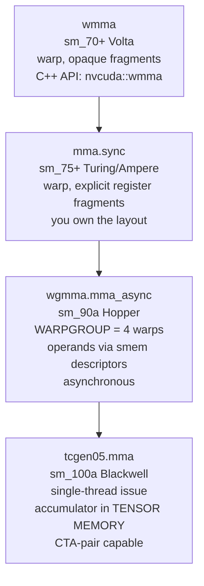

Note 03 was about moving data. This note is about what happens to it: arithmetic and its rounding modes, the `cvt` instruction that makes quantization possible, warp-level primitives, and the four generations of tensor-core instructions.

---

## 1. Arithmetic core set

### Integer

```ptx
add.s32       %r3, %r1, %r2;
add.sat.s32   %r3, %r1, %r2;         // saturating
mul.lo.s32    %r3, %r1, %r2;         // low 32 bits
mul.hi.s32    %r3, %r1, %r2;         // high 32 bits
mul.wide.s32  %rd1, %r1, %r2;        // 32×32 → 64  ← the sizeof-scaling idiom
mad.lo.s32    %r4, %r1, %r2, %r3;    // (a*b).lo + c
sad.u32       %r4, %r1, %r2, %r3;    // sum of absolute differences
div.s32 / rem.s32                     // expensive; the compiler avoids them
abs / neg / min / max / popc / clz / brev / bfe / bfi / bmsk / szext / shf / lop3
dp4a.s32.s32  %r4, %r1, %r2, %r3;    // 4-way int8 dot product + accumulate
dp2a.lo.s32.s32 %r4, %r1, %r2, %r3;  // 2-way int16×int8
```

> [!TIP]
> **`lop3.b32 d, a, b, c, immLut;`** is a 3-input lookup-table logic op — any Boolean function of three 32-bit inputs in one instruction. The `immLut` byte is the truth table. You'll see it wherever ptxas fuses bit manipulation, and in hand-written fp4/int4 unpacking code.
>
> **`prmt.b32 d, a, b, c;`** permutes arbitrary bytes from two source registers — the workhorse of low-precision packing/unpacking. Both are worth recognizing when you read quantization kernels.

### Floating point

```ptx
add.rn.f32     %f3, %f1, %f2;
mul.rn.f32     %f3, %f1, %f2;
fma.rn.f32     %f4, %f1, %f2, %f3;   // fused: ONE rounding
mad.f32        %f4, %f1, %f2, %f3;   // may be split into mul+add: TWO roundings
sub / abs / neg / min / max / copysign / testp
div.rn.f32     %f3, %f1, %f2;        // IEEE-correct division
div.approx.f32 %f3, %f1, %f2;        // fast path (-use_fast_math)
rcp.approx.f32 / sqrt.rn.f32 / sqrt.approx.f32 / rsqrt.approx.f32
sin.approx.f32 / cos.approx.f32 / lg2.approx.f32 / ex2.approx.f32 / tanh.approx.f32
```

> [!IMPORTANT]
> `expf(x)` compiles to `mul.f32 t, x, 0f3FB8AA3B; ex2.approx.f32 d, t;` — multiply by $\log_2 e$, then a hardware exp2. This is why softmax kernels in Triton and CUTLASS all compute in base 2: they fold the $\log_2 e$ into the scale factor and get the `ex2` for free. Spotting `0f3FB8AA3B` in a PTX dump tells you an exponential is happening.

### Half and packed math

```ptx
add.rn.f16      %rs3, %rs1, %rs2;      // scalar half
add.rn.f16x2    %r3,  %r1,  %r2;       // TWO halves in one 32-bit register
fma.rn.bf16x2   %r4,  %r1,  %r2, %r3;
fma.rn.f32.bf16 %f3,  %rs1, %rs2, %f1; // mixed precision: bf16 inputs, f32 accumulate (sm_100+)
add.f32x2       %rd3, %rd1, %rd2;      // two f32 in a 64-bit register (sm_100+)
max.f16x2 / min.f16x2 / neg.f16x2 / tanh.approx.f16 / ex2.approx.f16x2
```

Packed ops double throughput per instruction. When you see `f16x2`/`bf16x2` in Triton PTX, the vectorizer did its job; scalar `.f16` in a hot loop means it didn't.

---

## 2. `cvt` — the quantization instruction

Every low-precision format enters and leaves PTX through `cvt`. This section is the one to re-read when working on quantization.

```text
cvt{.irnd}{.ftz}{.sat}.dtype.atype   d, a;     // to integer
cvt{.frnd}{.ftz}{.sat}.dtype.atype   d, a;     // to float
```

| Rounding | Applies | Meaning |
|---|---|---|
| `.rn .rz .rm .rp` | float→float | nearest-even / toward-zero / −∞ / +∞ |
| `.rni .rzi .rmi .rpi` | float→int | same four, integer result |
| `.rna` | →tf32 | nearest, ties away from zero |
| `.rs` | →narrow (Blackwell) | **stochastic rounding**, takes an extra `rbits` operand |

| Saturation | Meaning |
|---|---|
| `.sat` | clamp to `[0,1]` for float, to type range for int |
| `.satfinite` | clamp out-of-range to the **max finite** of the target instead of producing inf/NaN |
| `.relu` | clamp negatives to `+0` |

### 16-bit narrowing

```ptx
cvt.rn.f16.f32                    %rs1, %f1;          // f32 → f16
cvt.rn.f16x2.f32                  %r1,  %f1, %f2;     // TWO f32 → packed f16x2  ← the fast path
cvt.rn.relu.satfinite.f16x2.f32   %r1,  %f1, %f2;
cvt.rn.bf16x2.f32                 %r1,  %f1, %f2;
cvt.rna.satfinite.tf32.f32        %r2,  %f1;          // f32 → tf32 for mma
cvt.f32.f16                       %f1,  %rs1;         // widen back
```

### fp8 / fp6 / fp4 (Hopper & Blackwell)

Every narrow format is **packed** — `x2` or `x4` values per instruction.

```ptx
// ── fp8 ──────────────────────────────────────────────────────────────
cvt.rn.satfinite.e4m3x2.f32       %rs1, %f1, %f2;   // 2× f32 → 2× e4m3 in a .b16
cvt.rn.satfinite.e5m2x2.f32       %rs1, %f1, %f2;
cvt.rn.relu.satfinite.e4m3x2.f16x2 %rs1, %r1;       // from packed halves
cvt.rn.f16x2.e4m3x2               %r1,  %rs1;       // dequantize back to f16x2

// ── fp6 (Blackwell) ──────────────────────────────────────────────────
cvt.rn.satfinite.e2m3x2.f32       %rs1, %f1, %f2;   // 2/3 split
cvt.rn.satfinite.e3m2x2.f32       %rs1, %f1, %f2;   // 3/2 split
cvt.rn.relu.f16x2.e3m2x2          %r1,  %rs1;

// ── fp4 (Blackwell) ──────────────────────────────────────────────────
cvt.rn.satfinite.e2m1x2.f32       %rs_b8, %f1, %f2; // 2× f32 → 2× e2m1 in a .b8
cvt.rn.relu.f16x2.e2m1x2          %r1,  %rs_b8;

// ── microscaling (MX / NVFP4) ────────────────────────────────────────
cvt.rz.satfinite.ue8m0x2.f32      %rs1, %f1, %f2;   // compute two ue8m0 block scales
cvt.rn.relu.satfinite.scaled::n2::ue8m0.bf16x2.e4m3x2  %r1, %rs1, %rs_scale;
//   ↑ dequantize fp8 → bf16 AND apply the per-block ue8m0 scale in one instruction

// ── stochastic rounding (Blackwell) ──────────────────────────────────
cvt.rs.satfinite.e2m1x4.f32       %r1, {%f1,%f2,%f3,%f4}, %r_rbits;
cvt.rs.f16x2.f32                  %r2, %f1, %f2, %r_rbits;
```

The alternate-format table (register types, exponent/mantissa splits) is in [note 01 §4](/cuda/09-ptx/01-ptx-language-fundamentals/).

> [!IMPORTANT]
> **`.satfinite` is not optional in practice.** Without it, an fp32 value outside e4m3's range (±448) converts to inf or NaN and poisons the rest of the network. Every production fp8 cast path uses `cvt.rn.satfinite.e4m3x2.f32`. If you're debugging NaNs in an fp8 pipeline, grep the PTX for `cvt.*e4m3` and check whether `.satfinite` is there.

> [!TIP]
> **Reading a quantized kernel's PTX:**
> - `cvt.*.e4m3x2.*` / `.e5m2x2.*` → fp8 cast, typically in an epilogue or a weight-load path.
> - `cvt.*.ue8m0x2.*` → block-scale computation; the kernel is MXFP.
> - `.scaled::n2::ue8m0` on a widening `cvt` → **fused dequant**: no separate multiply.
> - `prmt.b32` / `lop3.b32` clusters → hand-rolled sub-byte packing/unpacking (int4, fp4).
> - `cvt.rs.*` → stochastic rounding, usually a training-time quantizer.

---

## 3. Warp-level primitives

| PTX | CUDA | Notes |
|---|---|---|
| `shfl.sync.{up,down,bfly,idx}.b32 d\|p, a, b, c, mask` | `__shfl_*_sync` | `b` = delta/lane, `c` = clamp/segmask, `\|p` = "source lane was valid" |
| `vote.sync.{all,any,uni}.pred p, q, mask` | `__all_sync` / `__any_sync` | |
| `vote.sync.ballot.b32 r, p, mask` | `__ballot_sync` | one bit per lane |
| `activemask.b32 r;` | `__activemask()` | currently converged lanes |
| `match.sync.{any,all}.b32 d{\|p}, a, mask` | `__match_any_sync` | lanes holding the same value — histogram aggregation |
| `redux.sync.{add,min,max,and,or,xor}.<t> d, a, mask` | `__reduce_*_sync` | **single-instruction warp reduction** (sm_80+); beats a `shfl` tree |
| `elect.sync d\|p, mask` | — | elect exactly one lane |
| `bar.warp.sync mask` | `__syncwarp` | |

```ptx
// A full warp sum, the sm_80+ way:
redux.sync.add.s32 %r_sum, %r_val, -1;      // -1 = 0xffffffff = full warp

// vs the classic shuffle tree (5 instructions):
shfl.sync.bfly.b32 %f2|%p, %f1, 16, 31, -1;  add.f32 %f1, %f1, %f2;
shfl.sync.bfly.b32 %f2|%p, %f1,  8, 31, -1;  add.f32 %f1, %f1, %f2;
// ... 4, 2, 1
```

`redux.sync` covers integers and (sm_100+) `f32` with `.abs`/`.NaN` modifiers. For float on older targets you still need the shuffle tree — which is why you'll keep seeing it.

---

## 4. Tensor cores: four generations



| | Issue unit | A operand | B operand | Accumulator | Sync |
|---|---|---|---|---|---|
| `wmma` | warp (32 thr) | opaque fragment | opaque fragment | registers | synchronous |
| `mma.sync` | warp (32 thr) | registers | registers | registers | synchronous |
| `wgmma.mma_async` | **warpgroup** (128 thr) | registers **or** smem descriptor | smem descriptor | registers | async: `fence`/`commit_group`/`wait_group` |
| `tcgen05.mma` | **one thread** | tensor memory **or** smem descriptor | smem descriptor | **tensor memory** | async: `tcgen05.commit` → mbarrier |

The trend is unmistakable: **fewer threads issue, operands move out of registers, completion becomes asynchronous.** Each step frees register file and instruction issue for everything else.

### 4.1 `wmma` — the friendly one

```ptx
wmma.load.a.sync.aligned.row.m16n16k16.shared.f16  {%r1,...,%r8}, [%rd1], %r_stride;
wmma.load.b.sync.aligned.col.m16n16k16.shared.f16  {%r9,...,%r16}, [%rd2], %r_stride;
wmma.mma.sync.aligned.row.col.m16n16k16.f32.f32    {%f1,...,%f8}, {...}, {...}, {%f1,...,%f8};
wmma.store.d.sync.aligned.row.m16n16k16.shared.f32 [%rd3], {%f1,...,%f8}, %r_stride;
```

Shapes `m16n16k16`, `m32n8k16`, `m8n32k16`. Fragment layout is **opaque** — you must not assume which thread holds which element. This is what `nvcuda::wmma` in C++ maps to. Simple, but leaves performance on the table; modern libraries don't use it.

### 4.2 `mma.sync` — the one you'll read most

```ptx
.reg .b32 %Ra<4>, %Rb<2>;     // A: 4 regs of f16x2 = 8 halves ; B: 2 regs = 4 halves
.reg .f32 %Rc<4>, %Rd<4>;     // C/D: 4 f32

mma.sync.aligned.m16n8k16.row.col.f32.f16.f16.f32
  {%Rd0, %Rd1, %Rd2, %Rd3},
  {%Ra0, %Ra1, %Ra2, %Ra3},
  {%Rb0, %Rb1},
  {%Rc0, %Rc1, %Rc2, %Rc3};
```

Read the qualifiers: `m16n8k16` shape · `row` A-layout · `col` B-layout · `.f32` D type · `.f16` A type · `.f16` B type · `.f32` C type.

Shapes and types actually in use:

| Types | Shapes |
|---|---|
| `.f16`/`.bf16` × `.f16`/`.bf16` → `.f16`/`.f32` | `m16n8k8`, `m16n8k16` (`m8n8k4` is legacy) |
| `.tf32` | `m16n8k4`, `m16n8k8` |
| `.f64` | `m8n8k4`, `m16n8k4/8/16` |
| `.e4m3`/`.e5m2` (fp8) | `m16n8k16`, `m16n8k32` |
| `.kind::f8f6f4` (fp8/fp6/fp4 mixed) | `m16n8k32` |
| `.s8`/`.u8` | `m8n8k16`, `m16n8k16`, `m16n8k32` |
| `.s4`/`.u4` | `m8n8k32`, `m16n8k32`, `m16n8k64` |
| `.b1` (+ `.xor`/`.and` + `.popc`) | `m8n8k128`, `m16n8k128`, `m16n8k256` |
| block-scaled `.kind::mxf4` / `.mxf4nvf4` / `.mxf8f6f4` | `m16n8k32`, `m16n8k64` |

**Fragment layouts are explicit and specified.** For `mma.m16n8k16` with `.f16`/`.bf16`, matrix A (8 elements `a0..a7` across 4 registers):

```text
groupID           = %laneid >> 2          // 0..7
threadID_in_group = %laneid % 4           // 0..3

row = groupID              for a0,a1,a4,a5
      groupID + 8          otherwise
col = threadID_in_group*2 + (i & 1)          for a0..a3
      threadID_in_group*2 + (i & 1) + 8      for a4..a7
```

The accumulator C/D is 4 `.f32` registers with `row = groupID` / `groupID + 8` and `col = threadID_in_group*2 + (i & 1)`.

> [!IMPORTANT]
> You almost never compute these by hand — but you must know they are **specified, not opaque**. That's the whole difference from `wmma`, and it is why CUTLASS/CuTe can build arbitrary epilogues: it knows exactly which lane holds which output element, so it can fuse a bias, an activation, and an fp8 cast without a shared-memory round trip.

### Feeding `mma`: `ldmatrix` / `stmatrix` / `movmatrix`

```ptx
ldmatrix.sync.aligned.m8n8.x4.shared::cta.b16 {%r1,%r2,%r3,%r4}, [%r_addr];
ldmatrix.sync.aligned.m8n8.x2.trans.shared.b16 {%r1,%r2}, [%r_addr];
stmatrix.sync.aligned.m8n8.x4.shared.b16 [%r_addr], {%r1,%r2,%r3,%r4};
movmatrix.sync.aligned.m8n8.trans.b16 %r2, %r1;      // transpose in registers
```

`ldmatrix` loads 8×8 tiles from shared memory **directly into the exact register layout `mma` wants**, including an optional transpose. Each of the 32 lanes supplies one row address; the hardware does the shuffle. Without it you'd need a shared-memory transpose plus per-lane gathers.

Newer forms handle sub-byte source formats (`.b8x16.b6x16_p32`, `.b4x16_p64`) — that's fp6/fp4 unpacking done inside the load.

### Sparsity

```ptx
mma.sp::ordered_metadata.sync.aligned.m16n8k32.row.col.f32.f16.f16.f32
  {%Rd0..3}, {%Ra0..3}, {%Rb0..3}, {%Rc0..3}, %r_metadata, 0x0;
```

2:4 structured sparsity — A is stored at half density with a metadata register selecting which 2 of every 4 elements are non-zero, doubling effective K.

### 4.3 `wgmma` — Hopper's asynchronous warpgroup MMA

A **warpgroup** is 4 consecutive warps (128 threads) whose `%warpid` share `warpid >> 2`. All 128 must execute the instruction.

```ptx
wgmma.fence.sync.aligned;                    // order prior register accesses vs the async MMA
wgmma.mma_async.sync.aligned.m64n256k16.f32.f16.f16
        {%f0, ..., %f127},                   // D: 128 f32 accumulator registers per thread
        %rd_descA,                           // A: 64-bit SHARED MEMORY DESCRIPTOR
        %rd_descB,                           // B: 64-bit shared memory descriptor
        1,                                   // scale-d: 1 = accumulate into D, 0 = overwrite
        1, 1,                                // imm-scale-a, imm-scale-b : ±1 (negate operand)
        0, 1;                                // imm-trans-a, imm-trans-b
wgmma.commit_group.sync.aligned;
wgmma.wait_group.sync.aligned 0;             // 0 = wait for all; N = allow N groups in flight
```

Shapes are `m64nNk16` (f16/bf16), `m64nNk8` (tf32), `m64nNk32` (fp8, int8) with `N` from 8 to 256 in steps of 8. **M is always 64** — that's the warpgroup.

The **matrix descriptor** is a 64-bit register, not a pointer:

| Bits | Field |
|---|---|
| 13–0 | encoded shared-memory start address |
| 29–16 | leading-dimension byte offset |
| 45–32 | stride-dimension byte offset |
| 51–49 | matrix base offset |
| 63–62 | swizzle mode: `0` none, `1` 128 B, `2` 64 B, `3` 32 B |

> [!IMPORTANT]
> Three things make `wgmma` different in kind from `mma.sync`:
> 1. **Operands come from shared memory**, addressed by a descriptor — so A and B never occupy registers, and the whole register file goes to accumulators.
> 2. **It is asynchronous.** `wgmma.commit_group` / `wgmma.wait_group N` is the same batching idiom as `cp.async`, and `wait_group 1` lets one MMA overlap the next tile's TMA.
> 3. **It reads shared memory through the async proxy**, so a plain `st.shared` before it needs `fence.proxy.async.shared::cta` (note 03). `wgmma.fence` orders the *register* side; the proxy fence orders the *memory* side. You need both.
>
> The **swizzle mode** in the descriptor must match the swizzle the TMA descriptor wrote with. Mismatched swizzle is the classic silent-wrong-answer bug in hand-written Hopper GEMMs.

### 4.4 `tcgen05` — Blackwell's 5th-gen tensor cores

The accumulator leaves the register file entirely and moves into a dedicated on-chip **Tensor Memory (TMEM)**: 128 lanes × 512 columns × 32 bits per CTA on sm_100a. A TMEM address is a 32-bit value — `lane index` in bits 31–16, `column index` in bits 15–0.

```ptx
// ── allocate TMEM (one warp does this, result lands in shared memory) ──
tcgen05.alloc.cta_group::1.sync.aligned.shared::cta.b32 [%r_smem_slot], 128;  // 128 columns
ld.shared.b32 %r_taddr, [%r_smem_slot];

// ── the MMA: issued by a SINGLE thread ────────────────────────────────
tcgen05.mma.cta_group::1.kind::f16
        [%r_taddr],        // D  : tensor memory address
        %rd_descA,         // A  : smem descriptor (or [a-tmem] for A already in TMEM)
        %rd_descB,         // B  : smem descriptor
        %r_idesc,          // instruction descriptor: shapes, types, transposes, sparsity
        %p_enable_input_d; // accumulate into D (true) or overwrite (false)

// ── completion via mbarrier ───────────────────────────────────────────
tcgen05.commit.cta_group::1.mbarrier::arrive::one.b64 [bar];
$wait:
mbarrier.try_wait.parity.shared::cta.b64 %p1, [bar], %r_par;
@!%p1 bra $wait;

// ── read results back to registers ────────────────────────────────────
tcgen05.ld.sync.aligned.32x32b.x2.b32 {%r1, %r2}, [%r_taddr];
tcgen05.wait::ld.sync.aligned;                    // before the next MMA touches taddr

// ── free it (mandatory before kernel exit) ────────────────────────────
tcgen05.dealloc.cta_group::1.sync.aligned.b32 %r_taddr, 128;
tcgen05.relinquish_alloc_permit.cta_group::1.sync.aligned;
```

The rest of the family:

| Instruction | Purpose |
|---|---|
| `tcgen05.alloc` / `.dealloc` / `.relinquish_alloc_permit` | TMEM lifecycle. Allocation granularity is 32 columns, power-of-two count; **all TMEM must be freed before kernel exit** |
| `tcgen05.ld` / `.st` | TMEM ↔ registers, shapes `.32x32b`, `.16x64b`, `.16x128b`, `.16x256b`, `.16x32bx2`, `.x1`…`.x128` |
| `tcgen05.ld.red` | load **with** a `min`/`max` reduction folded in |
| `tcgen05.cp` | shared memory → TMEM, with optional fp4→fp8 / fp6→fp8 **decompression in flight** |
| `tcgen05.shift` | shift TMEM rows (convolution sliding window) |
| `tcgen05.mma` / `.sp` / `.ws` / `.ws.sp` | dense / sparse / weight-stationary variants |
| `tcgen05.fence`, `tcgen05.wait::{ld,st}`, `tcgen05.commit` | ordering and completion |

**MMA kinds**, which is where quantization meets tensor cores:

| `.kind` | Element types | Block scaling |
|---|---|---|
| `.kind::f16` | f16, bf16 | — |
| `.kind::tf32` | tf32 | — |
| `.kind::i8` | s8/u8 | — |
| `.kind::f8f6f4` | e4m3, e5m2, e3m2, e2m3, e2m1 mixed | — |
| `.kind::mxf8f6f4` | same, **microscaled** | `ue8m0`, `scale_vec::1X` |
| `.kind::mxf4` | e2m1 | `ue8m0`, `scale_vec::2X` |
| `.kind::mxf4nvf4` | e2m1 | `ue8m0` or `ue4m3`, `scale_vec::2X`/`4X`, `block16`/`block32` |

```ptx
tcgen05.mma.cta_group::2.kind::mxf4nvf4.block_scale.scale_vec::4X
        [%r_d_tmem], %rd_descA, %rd_descB, %r_idesc,
        [%r_scaleA_tmem], [%r_scaleB_tmem], %p_enable_d;
```

`.cta_group::2` issues across a **CTA pair** — two CTAs in a cluster cooperate on one MMA, doubling the effective tile. This is why Blackwell GEMMs use cluster dims of 2 in the M direction.

> [!TIP]
> **NVFP4 vs MXFP4** — both pack weights as `e2m1` (4 bits), but MXFP4 uses a **`ue8m0`** (power-of-two) scale per 32-element block, while NVFP4 uses a **`ue4m3`** scale per **16**-element block. Finer blocks and a mantissa in the scale mean less quantization error. In PTX that's exactly `.kind::mxf4` + `scale_vec::2X` versus `.kind::mxf4nvf4` + `scale_vec::4X`/`block16` with `.ue4m3`.

---

## 5. What to grep for

```bash
grep -oE 'wmma[^ ]*'                k.ptx   # Volta-era; rare in modern libraries
grep -oE 'mma\.sync[^ ]*'           k.ptx   # Turing/Ampere warp MMA
grep -oE 'wgmma[^ ]*'               k.ptx   # Hopper warpgroup MMA
grep -oE 'tcgen05[^ ]*'             k.ptx   # Blackwell
grep -oE 'ldmatrix[^ ]*'            k.ptx   # smem → mma fragment layout
grep -oE 'cvt[^ ]*e[0-9]m[0-9][^ ]*' k.ptx  # fp8/fp6/fp4 conversions
grep -oE 'cvt[^ ]*ue8m0[^ ]*'       k.ptx   # microscaling block scales
grep -cE 'fma\.rn\.f32'             k.ptx   # if high in a "GEMM", tensor cores were NOT used
grep -oE 'redux\.sync[^ ]*'         k.ptx   # single-instruction warp reductions
```

A GEMM-shaped kernel whose inner loop is `fma.rn.f32` and nothing else did **not** hit tensor cores. That single check catches a large fraction of "why is my Triton matmul 10× slower than cuBLAS".

---

## 6. Quick reference

| Intent | PTX |
|---|---|
| `__fmaf_rn(a,b,c)` | `fma.rn.f32` |
| `__expf(x)` | `mul.f32` by `0f3FB8AA3B` + `ex2.approx.f32` |
| `__half2` arithmetic | `add.rn.f16x2`, `fma.rn.f16x2` |
| `__float2half_rn` | `cvt.rn.f16.f32` |
| `__nv_cvt_float2_to_fp8x2` | `cvt.rn.satfinite.e4m3x2.f32` |
| `__dp4a` | `dp4a.s32.s32` |
| `__reduce_add_sync` | `redux.sync.add.s32` |
| `__shfl_xor_sync` | `shfl.sync.bfly.b32` |
| `__match_any_sync` | `match.sync.any.b32` |
| `nvcuda::wmma::mma_sync` | `wmma.mma.sync.aligned...` |
| CUTLASS Ampere MMA atom | `mma.sync.aligned.m16n8k16...` |
| CUTLASS Hopper MMA atom | `wgmma.mma_async.sync.aligned.m64nNk16...` |
| CUTLASS Blackwell MMA atom | `tcgen05.mma.cta_group::N.kind::...` |

---

## Interview Questions & Answers

### Q: Why did NVIDIA move the accumulator from registers (`mma.sync`) to shared-memory descriptors (`wgmma`) to tensor memory (`tcgen05`)?

**Answer:** Register file pressure and issue bandwidth. With `mma.sync`, A, B, and C all live in the 255-register-per-thread budget, so tile size is capped by registers, and 32 threads must each issue the instruction. `wgmma` moved A and B to shared memory behind a 64-bit descriptor: the entire register file becomes accumulator, tiles get much larger, and one instruction covers 128 threads' worth of work. `tcgen05` finished the job — the accumulator itself moves to a dedicated on-chip Tensor Memory, and a **single thread** issues the MMA. The other 127 threads are freed to run TMA copies, epilogues, and the next tile's setup. Each generation trades explicit register ownership for hardware-managed storage, which is also why each generation needs more elaborate synchronization (`wgmma.wait_group`, `tcgen05.commit` + mbarrier).

### Q: A Triton fp16 matmul on H100 shows `mma.sync.aligned.m16n8k16` in its PTX instead of `wgmma`. Is that a bug?

**Answer:** Not a bug, but it means you're leaving performance on the table. `wgmma` requires `.target sm_90a` — the architecture-*specific* target. If the kernel was compiled for plain `sm_90`, Triton's backend falls back to the portable Ampere-style `mma.sync` path. Other reasons: tile shapes too small to fill an `m64nNk16` warpgroup MMA (M below 64, or `num_warps` not a multiple of 4 so there's no complete warpgroup), or an operand layout Triton can't express as a shared-memory descriptor with a supported swizzle. Check the `.target` line at the top of the PTX first, then `num_warps` and `BLOCK_SIZE_M`.

### Q: What is `.satfinite` and why does every production fp8 path use it?

**Answer:** `.satfinite` on a narrowing `cvt` clamps values that exceed the destination format's range to its **maximum finite value** rather than producing infinity or NaN. e4m3 tops out at ±448 and e5m2 at ±57344 — activations and gradients routinely exceed those. Without `.satfinite` a single large value becomes inf, then the next matmul produces NaN, and the whole forward pass is poisoned. With it, the value is clamped, which is a bounded quantization error rather than a catastrophic one. e4m3 in particular has no infinity encoding at all (NaN is limited to `0x7f`/`0xff`), so `.satfinite` is the only sane behaviour.

### Q: What does `ldmatrix` do that a normal `ld.shared` cannot?

**Answer:** `mma.sync` requires each of the 32 lanes to hold specific, non-contiguous elements of the operand tile — lane 0 holds rows 0 and 8 at columns 0,1,8,9, and so on. Loading that with `ld.shared` means every lane computes its own strided addresses and issues several small loads, which both costs instructions and creates bank conflicts. `ldmatrix.sync.aligned.m8n8.x4.shared.b16` instead has each lane supply **one row address**, and the hardware performs the cross-lane redistribution into exactly the fragment layout `mma` expects — optionally transposing on the way (`.trans`), which would otherwise need a whole shared-memory transpose pass. Newer forms even unpack fp6/fp4 source data during the load. It is a layout instruction, not just a wide load.
